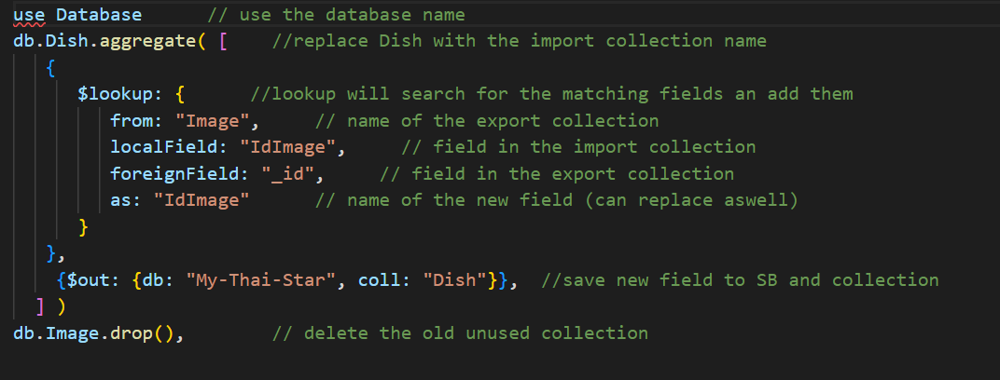
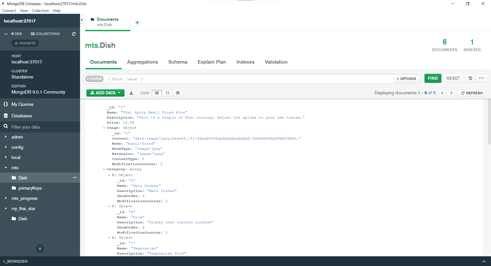
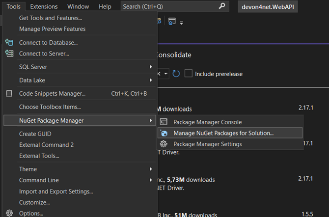
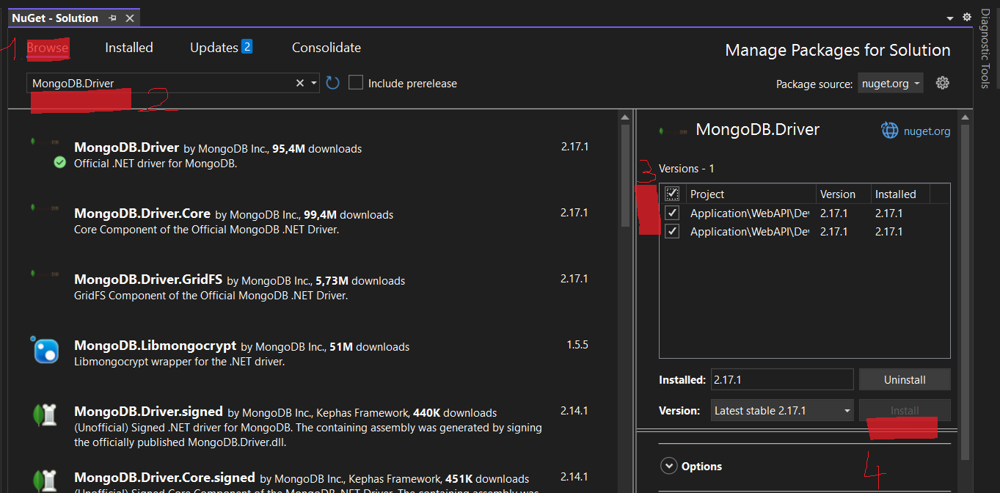

**MongoDB download and setup**

- In this tutorial the MongoDB Community Server was used.
- download and run the msi ([https://www.mongodb.com/try/download/community](https://www.mongodb.com/try/download/community))
- run through the steps of the installer
- At the Service Configuration the options chosen were:
  - Install MongoDB as a service
  - Run Service as Network User

**MongoDB Shell**

- Additionally, the MongoDB Shell needs to be downloaded ([https://www.mongodb.com/try/download/shell](https://www.mongodb.com/try/download/shell))

- Extract the mongosh.exe and mongosh-crypt\_v1.dll from the into the bin directory of the MongoDB server.

**Starting the MongoDB server**

- To start the local MongoDB navigate to the folder containing the Mongo.exe (MongoDB/Server/{​​​​​​​​​Version}​​​​​​​​​/bin/) and run the following command.

              mongosh "mongodb://localhost:27017"

Note: If mongosh was added to your path environment variable, you can start a local mongodb deamon on default 27017 Port with following cmd: _mongosh_

**Import data from SQL library**

- For the convertion/import use the Scripts from Ashley Davis Github by following these steps.

1. Clone the Repository (https://github.com/ashleydavis/sql-to-mongodb)
2. Run "npm install" in the cloned repository
3. Edit the Config.js file according to the project
  1. sqlConnectionString: "Server =; Database; User Id =; Password=; " full mssql connection String, including user and Password **(the user has to be "User Id = ")**
  2. mongoConnectionString: "mongodb://localhost:27017", example String as used in previous step
  3. targetDatabaseName: "MYDBNAME", name of the DB, can be freely chosen
4. Run the index.js by using the command

node index.js

**Changing the collection's structure**

- In order to use NoSql to its strength one might need to change the structure created by the script
- With a MongoDB shell script, the collections can be changed, one can use the following commands to do so:

**Setting up the MongoDB C# WebAPI Driver**

MongoDB delivers a great API which is easy to include and doesn't need much adjustment on the application side.
In a summary, one has to:

- Add the C# driver
- Create a Repository Interface and the corresponding Implementation
- Create an Entity
- Create the corresponding Entity Management
- Add filter functions

The mongodb driver fully supports deserializing primitive data types.

Those conversions happen through [Bson\*] properties, delivered by the MongoDB driver which we have to bind in our model entity to make use of them. Custom Types can be deserialized by defining sub-classes. And If you need even more control of the deserialization process, you can implement a custom serialization [[Custom Serialization](https://mongodb.github.io/mongo-csharp-driver/1.11/serialization/#customizing-serialization)].

In the following sections a more extensive walkthrough of the above summary is presented with an example entity Dish.

I am using the following MongoDB Instance, received by utilizing the MongoDBScript.js  which was mentioned in the prior section:

Note: In this example we populated our dish collection with fields which might be unnecessary. For example the _Dish.Image.ModificationCounter_ or the _Category.ModificationCounter_ fields could've been omited when populating our database. We did so, because of an easy and fast straigthforward population process from the old sql database to our new mongo database. Data modeling is a very extensive topic and thinking about the correct document structures is a crucial part of a migration from SQL to Nosql. Read more about this if needed.

**Add a MongoDB C# driver to your devon4net project**

.NET CLI

dotnet add package MongoDB.Driver

Package Manager

PM \> Install-Package MongoDB.Driver

Alternatively use the NuGet Package Solution Manager:

Tools \> NuGet Package Manager \> Manage NuGet Packages for Solution:

Search in the Browse Tab for MongoDB.Driver, check the Projext Box and press install.

**Create a Repository Interface and the corresponding Implementation**

Create an Interface inside the _Domain/RepositoryInterfaces_ directory for your NoSQL Repository. Following code was used to create a simple connection to a local Mongodb deamon.

Repository Interface:

    public interface IDishRepository
    {
        Task<List<Dish>> GetAll();
    }
    

Inside the _Data/Repositories_ directory create a repository implementation:

    public class DishNosqlRepository: IDishRepository

    {
        privatereadonly IMongoClient _mongoClient;

        privatereadonly IMongoCollection<Dish> _dishCollection;

        publicDishRepository()

        {
            var settings = MongoClientSettings.FromConnectionString("mongodb://localhost:27017");

            _mongoClient = new MongoClient(settings);

            var camelCaseConvention = new ConventionPack {
            new CamelCaseElementNameConvention() };

            ConventionRegistry.Register("CamelCase", camelCaseConvention, type => true);

            _dishCollection = _mongoClient.GetDatabase("my_thai_star_progress").GetCollection<Dish>("Dish");
        }
        publicasync Task<List<Dish>> GetAll()

        {
            var dishes = await _dishCollection
                .Find(Builders<Dish>.Filter.Empty)
                .ToListAsync();

            return dishes;
        }
    }

 Note:  Watchout to insert the correct database Name when you try to receive the collection via mongoClient.GetDatabase("database_Name").

**Create an Entity**

Inside the _Domain/Entities_ folder create a new entity class to deserialize the documents which come from our local MongoDB instance. In our example it might look like this:

    public class Dish
    {
      [BsonId]
      [BsonRepresentation(BsonType.ObjectId)]
      public string _id {get; set; }

      [BsonElement("Name")]
      public string Name {get; set; }

      [BsonElement("Price")]
      public decimal Price {get; set; }

      [BsonElement("Description")]
      public string Description {get; set; }

      [BsonElement("Image")]
      public ImageNosql Image {get; set; }

      [BsonElement("Category")]
      public ICollection<Category> Category {get; set; }
    }

Note: Take care of nested documents incoming from mongodb, via sub-classes for example ImageNosql which is not shown here.

**Create the Entity Management**

Inside the _Business_ directory create an _DishNosqlManagement_ directory with following sub-directories:
_Controllers, Converters, Dto_ and _Service_.

Create a service interface and implementation inside the _Business/DishNosqlManagement/Service _ directory e.g.:
Interface:

    public interface IDishService
    {
        Task<List<DishNosql>> GetDish();
    }

Implementation:

    public class DishService: IDishService
    {
        private readonly IDishRepository _dishRepository;

        public DishNosqlService(IDishNosqlRepository dishRepository)
        {
            _dishRepository = dishRepository;
        }

        public async Task<List<Dish>> GetDish() => await _dishRepository.GetAll();
    }

Inside the _Business/DishNosqlManagement/Controllers_ directory create a controller class:

    [ApiController]
    [Route("[controller]")]
    [EnableCors("CorsPolicy")]
    public class DishController: Controller
    {
        private readonly IDishService _dishService;

        public DishNosqlController(IDishNosqlService dishService)
        {
            _dishService = dishService;
        }

        [HttpGet]
        [ProducesResponseType(typeof(List<DishDto>), StatusCodes.Status200OK)]
        [ProducesResponseType(StatusCodes.Status400BadRequest)]
        [ProducesResponseType(StatusCodes.Status404NotFound)]
        [ProducesResponseType(StatusCodes.Status500InternalServerError)]
        [Route("/mythaistar/services/rest/dishmanagement/v2/dish")]
        publicasync Task<List<DishDto>> Get()
        {
            var result = await _dishService.GetDish();
            return result.Select(DishConverter.ModelToDto).ToList();
        }
    }

To create the data transfer object for our dish entity, add a class inside the _Business/DishNosqlManagement/Dto_ directory:

    public class DishDto
    {
        ///

        /// the Id
        ///

        public string Id {get; set; }

        ///

        /// the Name
        ///

        [Required]
        public string Name {get; set; }

        ///

        /// the Description
        ///

        [Required]
        public string Description {get; set; }

        ///

        /// the Price
        ///

        [Required]
        public decimal Price {get; set; }
    }

And as a last step create the necessary converter class inside the _Business/DishNosqlManagement/Converters_ ​​​​​​​directory:

    public class DishConverter
    {
        ///

        /// ModelToDto transformation
        ///

        ///<param name="item"></param>
        ///<returns></returns>
        public static DishDto ModelToDto(Dish item)
        {
            if (item == null) return new DishDto();

            return new DishDto
            {
                Id = item._id,
                Name = item.Name,
                Description = item.Description,
                Price = item.Price,
            };
        }
    }

**Lastly you need to add the newly created service to the Programm.cs**

builder.Services.AddSingleton<DishNosqlService>();

**Add filter functions**

Lets add two filter functions to our application. _GetDishesByCategory_ and _GetDishesMatchingCriteria_.

First add the API to our DishRepository Interface:

    public interface IDishRepository
    {
      Task<List<Dish>> GetAll();

      Task<IList<Dish>> GetDishesByCategory(IList<string> categoryIdList);

      Task<IList<Dish>> GetDishesMatchingCriteria(decimal maxPrice, int minLikes, string searchBy, IList<string> categoryIdList);
    }

Next implement them inside the DishRepository Class:

    public async Task<IList<Dish>> GetDishesByCategory(IList<string> categoryIdList)
    {
      return await _dishCollection
      .Find(Builders<Dish>.Filter.In("Category._id", categoryIdList))
      .ToListAsync();
    }

    public async Task<IList<Dish>> GetDishesMatchingCriteria(decimal maxPrice, int minLikes, string searchBy, IList<string> categoryIdList)
    {
      IList<Dish> result = await GetAll();**_
      
      if(categoryIdList.Any())
        {
          IList<Dish> temp = await GetDishesByCategory(categoryIdList);
          var tempIds = temp.Select(tempDish => tempDish._id);
          result = result.Where(item => tempIds.Contains(item._id)).ToList();
        }
          
      if (!string.IsNullOrWhiteSpace(searchBy))
        {
          IList<Dish> temp = await GetDishesByString(searchBy);
          var tempNames = temp.Select(tempDish => tempDish.Name);
          result = result.Where(item => tempNames.Contains(item.Name)).ToList();
        }
      
      if (maxPrice > 0)
        {
          IList<Dish> temp = await GetDishesByPrice(maxPrice);
          var tempPrices = temp.Select(tempDish => tempDish.Price);
          result = result.Where(item => tempPrices.Contains(item.Price)).ToList();
        }
          
      return result.ToList();
    }

Define the corresponding Interface IDishService:

    public interface IDishService
    {
      Task<IList<Dish>> GetDishesByCategory(IList<string> categoryIdList);**_
      Task<IList<Dish>> GetDishesMatchingCriteria(decimal maxPrice, int minLikes, string searchBy, IList<string> categoryIdList);
    }

Implement the depending DishService Class:

    public async Task<IList<Dish>> GetDishesByCategory(IList<string> categories)
    {
      var dish = await _dishRepository.GetDishesByCategory(categories);
      return dish;
    }

    public async Task<IList<Dish>> GetDishesMatchingCriteria(decimal maxPrice, int minLikes, string searchBy, IList<string> categoryIdList)
    {
      return await _dishRepository.GetDishesMatchingCriteria(maxPrice, minLikes, searchBy, categoryIdList);
    }

Add the corresponding WebAPI inside our DishController Class:

         [HttpPost]
         [AllowAnonymous]
         [ProducesResponseType(typeof(DishDto), StatusCodes.Status200OK)]
         [ProducesResponseType(StatusCodes.Status400BadRequest)]
         [ProducesResponseType(StatusCodes.Status404NotFound)]
         [ProducesResponseType(StatusCodes.Status500InternalServerError)]
         [Route("/mythaistar/services/rest/dishmanagement/v1/dish/search")]
         public async Task<IActionResult> DishSearch([FromBody] FilterDtoSearchObjectDto filterDto)
         {
             if (filterDto == null)
             {
                 filterDto = new FilterDtoSearchObjectDto {MaxPrice = 0, SearchBy = string.Empty, MinLikes = 0, Categories = new CategorySearchDto[]{}};
             }
             var (
                 categories,
                 searchBy,
                 maxPrice,
                 minLikes
             ) = filterDto;

             var categoryIds = categories.Select(c => c.Id).ToList();
             var dishQueryResult = await _DishService.GetDishesMatchingCriteria(maxPrice, minLikes, searchBy, categoryIds);
             var result = new ResultObjectDto<DishDtoResult> {};
             result.content = dishQueryResult.Select(DishConverter.EntityToApi).ToList();
             result.Pagination.Total = dishQueryResult.Count();**_

             return new ObjectResult(JsonConvert.SerializeObject(result));
         }

Note: _**GetDishesByPrice(maxPrice)**_ and _**GetDishesByString(searchBy)**_, are not shown in this example and are left as an exercise to learn more about the Mongodb C# API. The implementation of _**GetDishesByCategory(IList<string> categoryIdList)**_ can be used as a reference since it has a similar code.

If you need the full sample code because some parts have been omited, you can look it up here: [Github Repo](https://github.com/vlad961/Devon4netMongoDB.git)​​​​​​​
